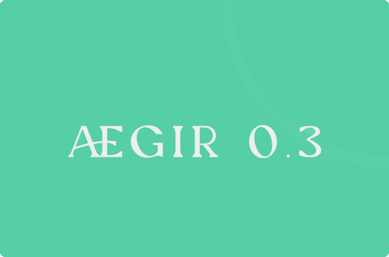

# Aegir Web Application - Automated Test Project

This project focuses on the automated testing of the Aegir web application's registration and data entry functionalities, with special attention to input validation, user feedback, and data security. The goal is to identify and document key issues to improve data quality and user experience.

**System Under Test (SUT) URL**: [Aegir 0.3](https://github.com/CodecoolGlobal/system-under-testing-registration-form-general-Hyacinto)

## Objective

The primary objective of this project is to uncover critical bugs in the Aegir web application, particularly those related to data input validation, duplicate entry prevention, and error messaging. These bugs may compromise data security, frustrate users, and reduce the integrity of stored information.

## Test Environment
------------

- **Browser:**

    [](https://www.mozilla.org/en-US/firefox/)
- **Operating System:**

    [](https://www.microsoft.com/en-us/windows/)
- **Devices Tested:** Desktop
- **Selenium Version:**

    [](https://www.selenium.dev/)
- **JDK Version:**

    [](https://openjdk.java.net/)

---

## Tools and Frameworks
------------

The following tools and frameworks are used in this automated testing project:

- **Selenium WebDriver**

    [](https://www.selenium.dev/)
- **JUnit**

    [](https://junit.org/)
- **Maven**

    [](https://maven.apache.org/)
- **Page Object Model (POM)**

     This test automation project uses the POM to organize test scripts and page elements in a maintainable and scalable structure. Each web page is represented by a separate class, encapsulating elements and behaviors associated with that page, thus enhancing code reusability and readability.

## Running the Tests

To run the tests, ensure that the required dependencies are installed. Use the following commands:

1. Install dependencies and build the project:
   ```shell
   mvn clean install

2. Run the tests:

    ```shell
    mvn test

Summary of Identified Issues
----------------------------

The following is a list of identified bugs, their descriptions, and their severity levels. These issues highlight areas where validation and error handling need improvement:

| Bug ID      | Description                                   | Severity |
|-------------|-----------------------------------------------|----------|
| SI3TASK2-1  | Duplicate username allowed during registration| High     |
| SI3TASK2-2  | No limit on username length                   | Medium   |
| SI3TASK2-3  | No upper limit on password length             | Medium   |
| SI3TASK2-4  | Data remains visible after logout             | High     |
| SI3TASK2-5  | No immediate feedback on invalid input        | Medium   |
| SI3TASK2-6  | Allows duplicate student entries              | High     |
| SI3TASK2-7  | No character length limit on certain input fields | Medium |
| SI3TASK2-8  | Email field only checks for "@" symbol        | Medium   |
| SI3TASK2-9  | Phone field accepts any characters, no length limit | Medium |
| SI3TASK2-10 | Personal ID field allows invalid formats      | Medium   |
| SI3TASK2-11 | ZIP field incorrectly validates specific ranges | Medium |
| SI3TASK2-12 | Start date validation allows out-of-range dates | Low     |


Bug Details
-----------

Below is a brief overview of selected high-priority issues:

### SI3TASK2-1: Successful registration with an existing username

*   **Severity:** High

*   **Issue:** Allows duplicate usernames during registration.

*   **Expected Behavior:** System should prevent duplicate usernames.

*   **Actual Behavior:** Allows duplicate usernames without any error.


### SI3TASK2-4: Data remains visible after logout

*   **Severity:** High

*   **Issue:** User data remains visible after logout, which is a security concern.

*   **Expected Behavior:** Redirect to login page after logout.

*   **Actual Behavior:** Data remains accessible on the List page.


### SI3TASK2-6: Duplicate student entries are allowed

*   **Severity:** High

*   **Issue:** Allows identical student records, leading to potential data redundancy.

*   **Expected Behavior:** System should prevent duplicate entries.

*   **Actual Behavior:** Duplicate entries are saved without any warning.


Evaluation and Confidence Level
-------------------------------

Based on the identified issues, the Aegir web application has several critical bugs, particularly in input validation and data security. These issues could impact the reliability and usability of the system, especially regarding duplicate entries and user data visibility.

*   **Confidence Level:** 65% confident that the system will function satisfactorily, but substantial fixes are necessary to ensure optimal performance and security.


Future Enhancements
-------------------

To improve system quality and user experience, consider the following enhancements:

*   Implement stricter input validation rules.

*   Add real-time error feedback for invalid entries.

*   Enforce constraints on field lengths and formats.

*   Ensure sensitive data is hidden or cleared upon logout.